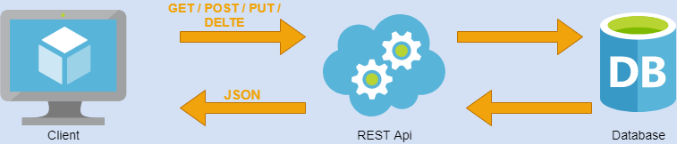
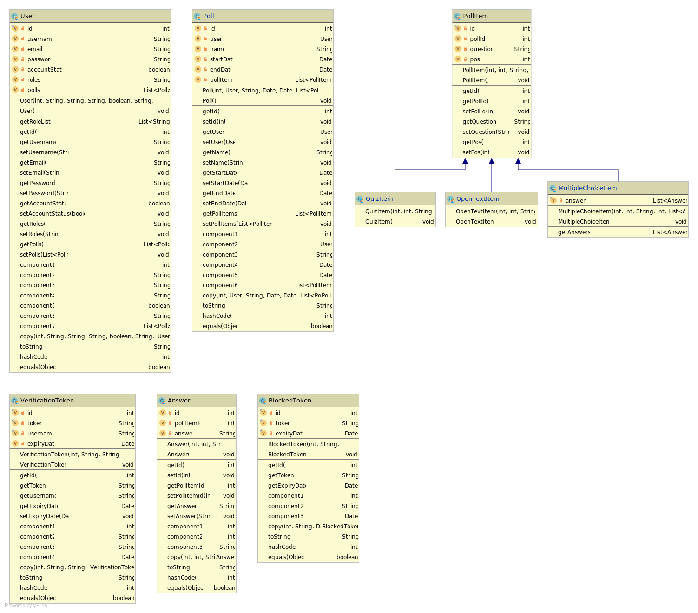

# Software Architecture Document

## Table of Contents 
1. [Introduction](#1-introduction)
    + [1.1 Purpose](#11-purpose)
    + [1.2 Scope](#12-scope)
    + [1.3 Definitions, Acronyms and Abbreviations](#13-definitions-acronyms-and-abbreviations)
    + [1.4 References](#14-references)
    + [1.5 Overview](#15-overview)
2. [Architectural Representation](#2-architectural-representation)
3. [Architectural Goals and Constraints](#3-architectural-goals-and-constraints)
4. [User-Case-View](#4-use-case-view)
    + [4.1 Use-Case Realizations](#41-use-case-realizations)
5. [Logical View](#5-logical-view)
    + [5.1 Overview](#51-overview)
    + [5.2 Architecturally Significant Design Packages](#52-architecturally-significant-design-packages)
6. [Process View](#6-process-view)
7. [Deployment View](#7-deployment-view)
8. [Implementation View](#8-implementation-view)
    + [8.1 Overview](#81-overview)
    + [8.2 Layers](#82-layers)
9. [Data View](#9-data-view)
10. [Size and Performance](#10-size-and-performance)
11. [Quality](#11-quality)

## 1. Introduction 
### 1.1 Purpose
This document provides a comprehensive architectural overview of the system, 
using a number of different architectural views to depict different aspects of the system. 
It is intended to capture and convey the significant architectural decisions which have been made on the system.

### 1.2 Scope
This SAD describes the architecture of the Live-Poll project. The class structure, the use cases and the data base schema are presented.

### 1.3 Definitions, Acronyms and Abbreviations
| Abbrevation | Description                            |
| ----------- | -------------------------------------- |
| API         | Application programming interface      |
| MVC         | Model View Controller                  |
| REST        | Representational state transfer        |
| SDK         | Software development kit               |
| SRS         | Software Requirements Specification    |
| UC          | Use Case                               |
| VCS         | Version Control System                 |
| n/a         | not applicable                         |

### 1.4 References

### 1.5 Overview
The following chapters contain the architectural design, goals, constraints and data views.
## 2. Architectural Representation
Principle of a REST API:

Angular concept:

## 3. Architectural Goals and Constraints

### Server-side
In order to be able to develop the frontend and backend independently of one another, we decided to create a REST Api. This also gives us the opportunity to develop other clients in addition to the angular app that is currently under development, such as a PowerPoint plugin.

### Client-side
On the client side we use Angular to develop a modern single-page client application.

## 4. Use-Case View

### 4.1 Use-Case Realizations
Each use case is individually documented. All use cases are linked in our [SRS](srs.md).
## 5 Logical View
### 5.1 Overview
This section shows an overview of the classes.
### 5.2 Architecturally Significant Design Packages
This image shows the current classes in our Spring backend:

## 6. Process View
tbd
## 7. Deployment View
tbd
## 8. Implementation View
tbd
### 8.1 Overview
### 8.2 Layers
## 9. Data View
Database ER-Diagram:

## 10. Size and performance
n/a
## 11. Quality
To ensure a good code quality and to avoid bugs each pull request is automatically checked by SonarQube. Furthermore at least one review is required to merge the pull request.
