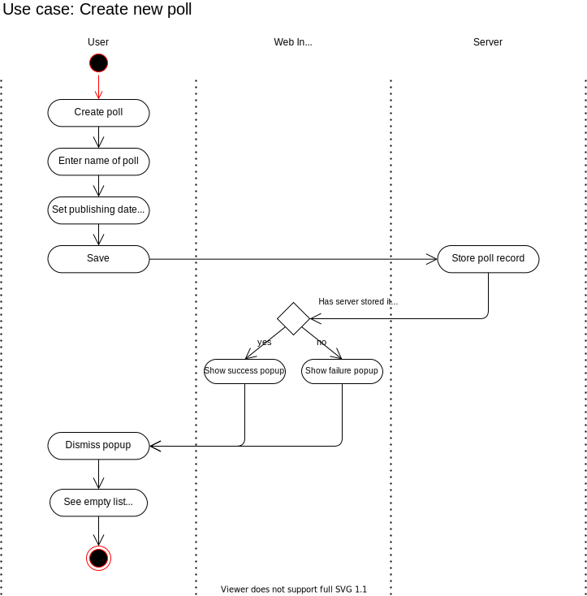

# Use Case Specification: Create new poll

## Table of contents
1. [Create new poll](#1-create-new-poll)
    + [1.1 Brief Description](#11-brief-descsription)
2. [Flow events](#2-flow-events)
    + [2.1 Basic Flow](#21-basic-flow)
    + [2.2 Alternative Flows](#22-alternative-flows)
3. [Special Requirements](#3-special-requirements)
4. [Preconditions](#4-preconditions)
5. [Postconditions](#5-postconditions)
6. [Extension Points](#6-extension-points)

## 1. Create new poll

# 1.1 Brief Description

## 2. Flow events
# 2.1 Basic Flow
# 2.2 Alternative Flows
## 3. Special Requirements
## 4. Preconditions
## 5. Postconditions
## 6. Extension Points