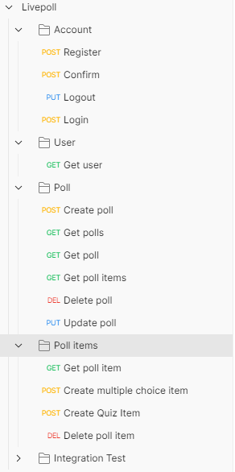
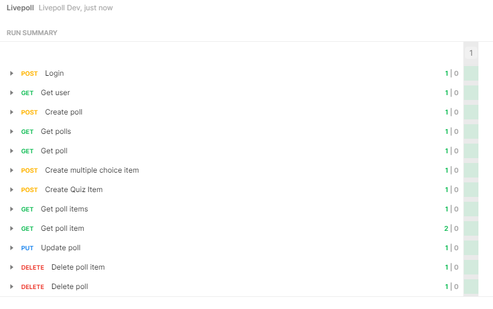

## Table of contents
{: .no_toc .text-delta }

1. TOC
{:toc}

## Testing
In order to be able to test our endpoints quickly and easily during development, we use Postman. In Postman we have created a collection, which helps us to send individual queries to certain endpoints. You can see the current state of our collection below. Furthermore we use Postman to create an integration test and test all endpoints at once.

### Integration Test
As you can see in the previous figure, in addition to the requests for manual testing, we have also created an folder called **Integration Test**. With the help of the collection runner we can execute all requests from this folder and can test the entire api. The following figure shows which requests are included in the integration test.

### Results
Here you can see the results of a test run. Every test passes.

