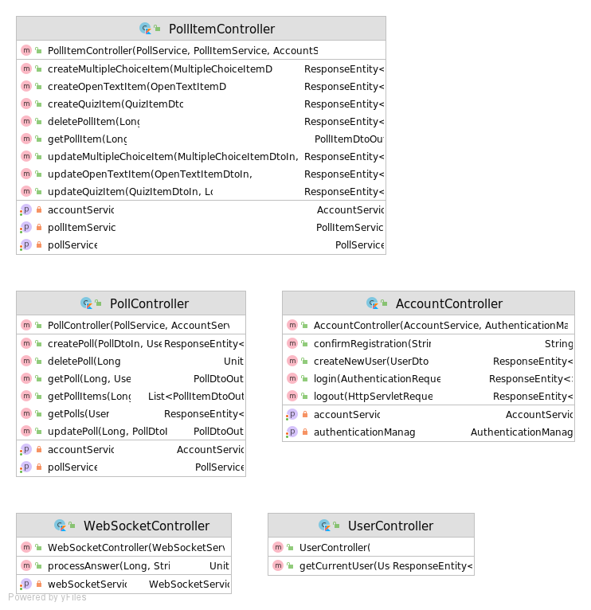

# Software Architecture Document 
{: .no_toc }

## Table of contents
{: .no_toc .text-delta }

1. TOC
{:toc}

## 1. Introduction 
### 1.1 Purpose
This document provides a comprehensive architectural overview of the system, 
using a number of different architectural views to depict different aspects of the system. 
It is intended to capture and convey the significant architectural decisions which have been made on the system.

### 1.2 Scope
This SAD describes the architecture of the Live-Poll project. It presents the class structure, the use cases and the data base schema.

### 1.3 Definitions, Acronyms and Abbreviations

| Abbrevation | Description                            |
|:-----------:|:--------------------------------------:|
| API         | Application programming interface      |
| MVC         | Model View Controller                  |
| REST        | Representational state transfer        |
| SDK         | Software development kit               |
| SRS         | Software Requirements Specification    |
| UC          | Use Case                               |
| VCS         | Version Control System                 |
| n/a         | not applicable                         |

### 1.4 References

### 1.5 Overview
The following chapters contain the architectural design, goals, constraints and data views.
## 2. Architectural Representation
Principle of a REST API:

Angular concept:

Spring Boot concept:

## 3. Architectural Goals and Constraints

### Server-side
In order to be able to develop the frontend and backend independently of one another, we decided to create a REST API with a flexible interface to communicate. This also gives us the opportunity to develop other clients in addition to the Angular app that is currently under development, such as a PowerPoint plugin.

### Client-side
On the client side we use Angular to develop a modern single-page client application.

## 4. Use-Case View

### 4.1 Use-Case Realizations
Each use case is individually documented. All use cases are linked in our [SRS](srs.md).
## 5 Logical View
### 5.1 Overview
This section shows an overview of the classes. Due to the lack of full Kotlin support for generating class diagrams, the diagram does not show relationships between the models, controllers or services.
### 5.2 Architecturally Significant Design Packages
This image shows the current database model for our MySQL database, connected to our Spring backend:

This are the current controllers:

And this are our current services:

## 6. Process View
n/a
## 7. Deployment View

## 8. Implementation View
n/a
### 8.1 Overview
### 8.2 Layers
## 9. Data View
Database ER-Diagram:

## 10. Size and performance
n/a
## 11. Quality
To ensure a good code quality and to avoid bugs, each pull request is automatically checked / rated by SonarQube. Furthermore at least one review is required to merge a pull request in both of our main repositories.

© Live-Poll 2020-2021