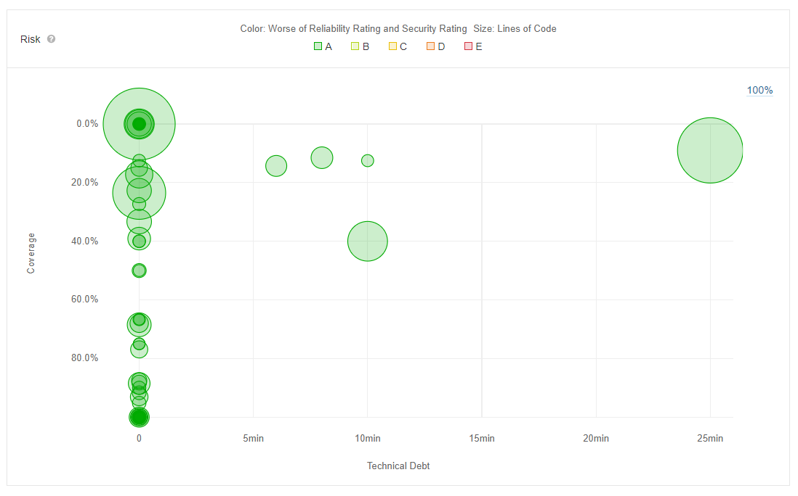

# Test plan
{: .no_toc }

## Table of contents
{: .no_toc .text-delta }

1. TOC
{:toc}

## 1.	Introduction
### 1.1	Purpose
The purpose of the Iteration Test Plan is to gather all of the information necessary to plan and control the test effort for a given iteration. 
It describes the approach to testing the software.
This Test Plan for **Live-Poll** supports the following objectives:
-	Identifies the items that should be targeted by the tests.
-	Identifies the motivation for and ideas behind the test areas to be covered.
-	Outlines the testing approach that will be used.
-	Identifies the required resources and provides an estimate of the test efforts.

### 1.2	Scope
This document describes the tests that are used during development. For this project unit tests and functional tests are used.

### 1.3	Intended Audience
This document is primarily intended for internal use and not for users of the application.

### 1.4	Document Terminology and Acronyms

| Abbreviation | Description                         |
|--------------|-------------------------------------|
| SRS          | Software Requirements Specification |
| UCD          | Use Case Diagram                    |
| n/a          | not applicable                      |

### 1.5	 References

| Resource  | Reference           |
|-----------|---------------------|
| SAD       | [visit](./sad.md)   |
| Use cases |[visit](./use-cases) |
            
## 2.	Evaluation Mission and Test Motivation
### 2.1	Background
We test our code in order to discover problems and to fix them at an early stage. This is to avoid a bad user experience and the loss of data. In addition the timely detection of bugs helps us to stay in the schedule and to be able to implement all use cases.
### 2.2	Evaluation Mission
The goal of this test plan is to fix all errors and bugs that could affect the end user experience .We want to achieve good software quality.
### 2.3	Test Motivators
For these reasons we are testing:
- quality requirements 
- find as many bugs as possible
- technical risks
- complete all use cases 
- functional requirements

## 3.	Target Test Items
The listing below contains all the elements which are targets for testing. 

Items for Testing:
- SpringBoot Backend

## 4.	Outline of Planned Tests
### 4.1	Outline of Test Inclusions
Testing the backend with unit tests and feature files.
### 4.2	Outline of Other Candidates for Potential Inclusion
Other interesting areas to test could be finding security holes or a stress test of the database
### 4.3 Outline of Test Exclusions
n/a

## 5.	Test Approach
### 5.1 Initital Test-Idea Catalogs and Other Reference Sources
n/a
### 5.2	Testing Techniques and Types
#### 5.2.1 Backend Unit Testing

| Step                   | Description                                                                                                                                                                                                                                                                     |
|------------------------|---------------------------------------------------------------------------------------------------------------------------------------------------------------------------------------------------------------------------------------------------------------------------------|
| Technique Objective    | The backend should be started and several tests should be carried out to find out whether everything is working correctly.                                                                                                                                                      |
| Technique 	         | All requests to the backend should be tested using the JUnit Framework. A separate database should be used for the tests so that no test data is stored on the productively used database. Here it is advisable to use an in-memory database with the same database technology. |
| Oracles 		 | The endpoints return the correct and expected data and the corresponding HTTP response codes.                                                                                                                                                                                   |
| Required Tools 	 | JUnit 4 Dependencies                                                                                                                                                                                                                                                            |
| Success Criteria	 | correct answers, passing tests and correct HTTP response codes                                                                                                                                                                                                                  |
| Special Considerations | -                                                                                                                                                                                                                                                                               |

#### 5.2.2 Backend Integration Testing

| Step                   | Description                                                                                                                |
|------------------------|----------------------------------------------------------------------------------------------------------------------------|
| Technique Objective  	 | The backend should be started and several tests should be carried out to find out whether everything is working correctly. |
| Technique 	         | A Postman Collection is used to test all existing endpoints.                                                               |
| Oracles 		 | The endpoints return the correct and expected data and the corresponding HTTP response codes.                              |
| Required Tools 	 | Postman                                                                                                                    |
| Success Criteria	 | passing tests and correct HTTP response codes                                                                              |
| Special Considerations | -                                                                                                                          |

## 6.	Entry and Exit Criteria
### 6.1	Test Plan
#### 6.1.1	Test Plan Entry Criteria
Pushing new commits to GitHub will trigger the  CI/CD pipeline.
#### 6.1.2	Test Plan Exit Criteria
The execution of the test plan ist complete when all tests are passed without exception.
#### 6.1.3 Suspension and Resumption Criteria
n/a

## 7.	Deliverables
### 7.1	Test Evaluation Summaries
Test results can be viewed in the logs on GitHub actions.
Our GitHub actions workflows can be found [here](https://github.com/livepoll/live-poll-api/actions).
### 7.2	Reporting on Test Coverage
The current test coverage for the backend can be found in the [README](https://github.com/livepoll/live-poll-api/blob/develop/README.md) file.
### 7.3	Perceived Quality Reports
n/a
### 7.4	Incident Logs and Change Requests
Test incidents are tracked by our GitHub actions CI/CD pipeline.
### 7.5	Smoke Test Suite and Supporting Test Scripts
n/a
### 7.6	Additional Work Products
#### 7.6.1	Detailed Test Results
GitHub actions log
#### 7.6.2	Additional Automated Functional Test Scripts
n/a
#### 7.6.3	Test Guidelines
All tests should be easy to understand. It should be easy to find out where the exception occured.
#### 7.6.4	Traceability Matrices
n/a

## 8.	Testing Workflow
Newly developed functions and features should first be tested locally. The new code should only be pushed when all tests have been passed locally. Then all tetst are still executed once in the CI/CD pipeline

## 9.	Environmental Needs
This section presents the non-human resources required for the Test Plan.
### 9.1	Base System Hardware
The following table sets forth the system resources for the test effort presented in this Test Plan.

| Resource           | Quantity | Name and Type                               |
|--------------------|----------|---------------------------------------------|
| Local test machine | 1        | Own notebook                                |
| Production Server  | 1        | API provider / Frontend provider / Database |
| GitHub CI/CD       | 1        | Testing, building and deploying application |

### 9.2	Base Software Elements in the Test Environment
The following base software elements are required in the test environment for this Test Plan.

| Software Element Name | Version | Type and Other Notes |
|---|---|---|
| Linux | latest | Operating System |
| SpringBoot | latest | Famework |
| MySQL | latest | Database |

### 9.3	Productivity and Support Tools
The following tools will be employed to support the test process for this Test Plan.

| Tool Category or Type | Tool Brand Name                                       |
|-----------------------|-------------------------------------------------------|
| Repository            | [GitHub](https://github.com/)                         |
| CI/CD Service         | [GitHub actions](https://github.com/features/actions) |
| Metrics               | [Codecov](https://about.codecov.io/)                  |
| Metrics               | [Sonarqube](https://www.sonarqube.org/)               |

### 9.4	Test Environment Configurations
n/a 

## 10.	Responsibilities, Staffing, and Training Needs
### 10.1	People and Roles
This table shows the staffing assumptions for the test effort.

Human Resources

| Role                                     | Specific Responsibilities or Comments                                          |
|------------------------------------------|--------------------------------------------------------------------------------|
| Test Manager                             | Provides management oversight                                                  |
| Test Designer                            | Defines the technical approach to the implementation of the test effort        |
| Tester                                   | Implements and executes the tests                                              |
| Test System Administrator                | Ensures test environment and assets are managed and maintained                 | 
| Database Administrator, Database Manager | Ensures test data (database) environment and assets are managed and maintained |
| Implementer                              | Implements and unit tests the test classes and test packages                   |

### 10.2	Staffing and Training Needs
n/a

## 11.	Iteration Milestones

| Milestone                         | Start Date               |  Finished             | 
|-----------------------------------|--------------------------|-----------------------|
| Have Unit Tests with 20% coverage | 01.05.2021               | tbd                   | 
| Tests integrated in CI            | Start of first semester  | End of first semester | 
| Postman Testing                   | Start of second semester | 02.05.2021            | 

## 12.	Risks, Dependencies, Assumptions, and Constraints

| Risk                                     | Mitigation Strategy                 | Contingency (Risk is realized) |
|------------------------------------------|-------------------------------------|--------------------------------|
| Unexpected failures in production system | Cover as many scenarios as possible | Note CI / CD logs when pushing |

## 13. Management Process and Procedures
n/a

## 14. Documentation on deployment process
At a later point in time in our project, we analyzed the backend with the help of metrics. We used the tool Sonarqube for this. Since we already did detailed [code reviews](https://github.com/livepoll/live-poll-api/pull/84) when pushing new changes and paid attention to good code quality, Sonarqube could not find any problems. Below can see our [Sonarqube metrics overview](https://sonarqube.live-poll.de/component_measures?id=live-poll-api): 

