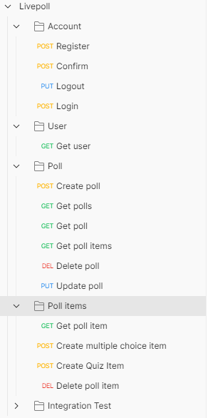
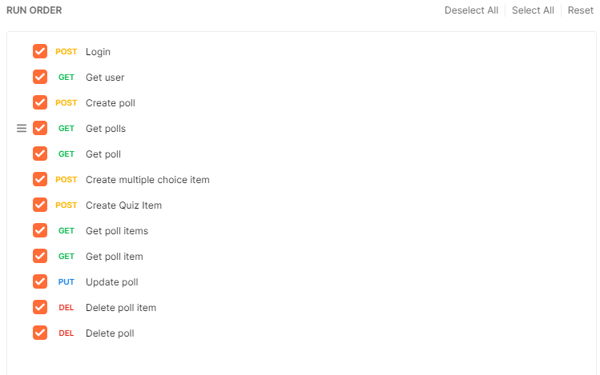
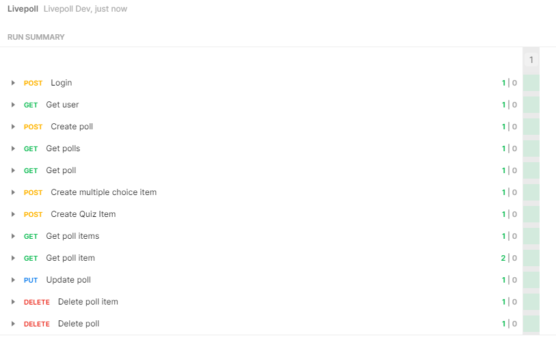
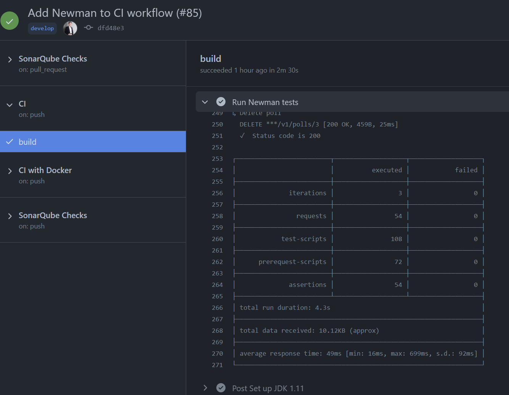

# Testing
{: .no_toc }

## Table of contents
{: .no_toc .text-delta }

1. TOC
{:toc}

## Testing with JUnit
To ensure good code quality and well functional features, we have unit tests in place to test single methods and keep them working.  
See an example test [here](https://github.com/livepoll/live-poll-api/blob/develop/src/test/kotlin/de/livepoll/api/controller/v1/PollItemServiceTest.kt).

## Testing with Cucumber
We also have a few of our usecases covered with Cucumber integration tests.  
You can find our feature files [here](https://github.com/livepoll/live-poll-api/tree/develop/src/test/resources/features).

## Testing with Postman
In order to be able to test our endpoints quickly and easily during development, we use Postman. In Postman we have created a collection, which helps us to send individual queries to certain endpoints. You can see the current state of our collection below. Furthermore, we use Postman to create an integration test and test all endpoints at once.

### Integration Test
As you can see in the previous figure, in addition to the requests for manual testing, we have also created an folder called **Integration Test**. With the help of the collection runner we can execute all requests from this folder and can test the entire api. The following figure shows which requests are included in the integration test.

### Results
Here you can see the results of a test run: Every test passes.

## Newman
Postman offers a CLI tool, which can be fed with a collection export of Postman. Newman then executes the same requests and the same test script, Postman does. This opens the possiblity for us to execute our Postman tests in our GitHub Actions CI/CD workflows.

As Postman tests require the API and a database to be running, we had to adjust our workflow so that it boots up the API and a test database after a successful build. We used Docker for this.

The output of a successful run of the Newman tests looks like this:

