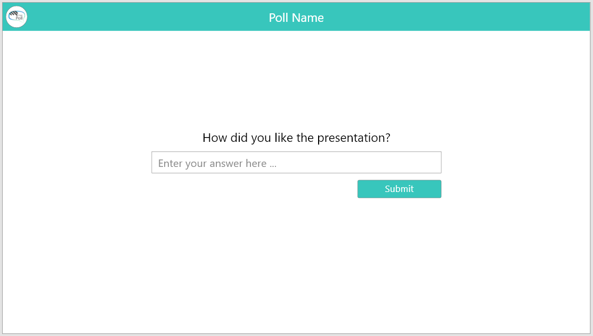
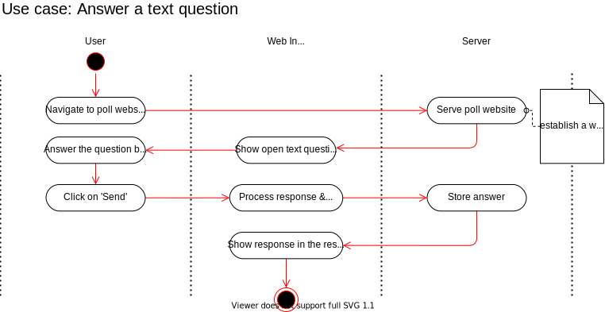

# Use Case Specification: Answer open text question
{: .no_toc }

## Table of contents
{: .no_toc .text-delta }

1. TOC
{:toc}

## 1. Answer open text question
### 1.1 Brief Description
In this use case, the participant can enter his answer to a question in a text field.
### 1.2 Mockup

## 2. Flow of Events
### 2.1 Basic Flow

### 2.2 Feature Files
n/a
### 2.3 Alternative Flows
n/a
## 3. Special Requirements
n/a
## 4. Preconditions
Following preconditions are needed:
- The user signed up.
- The user created a poll.
- The user create a poll-item.
- The poll-item which is live is an open text question.
## 5. Postconditions
Once the participant entered an answer, the answer must be saved on the server.
## 6. Extension Points
n/a