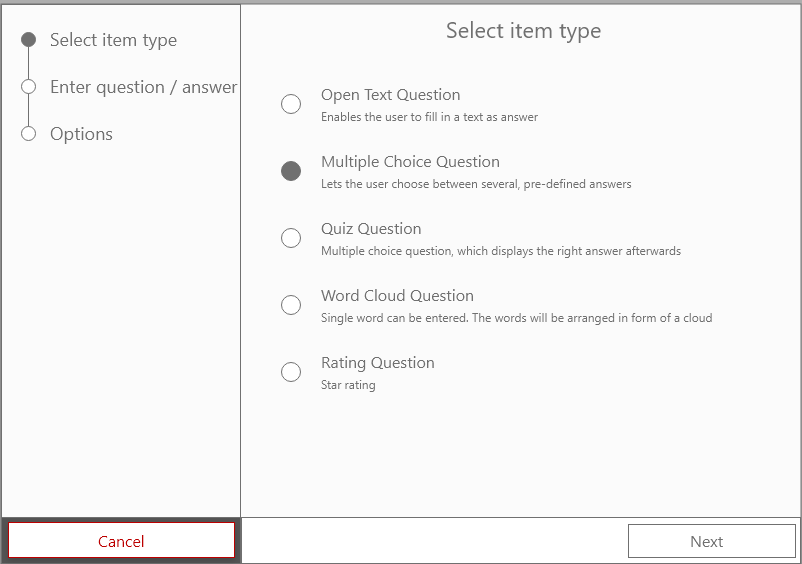
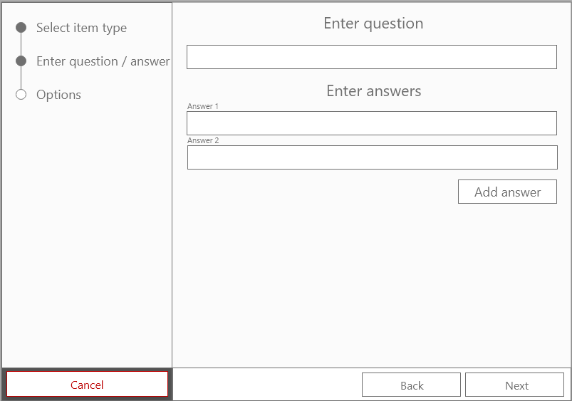
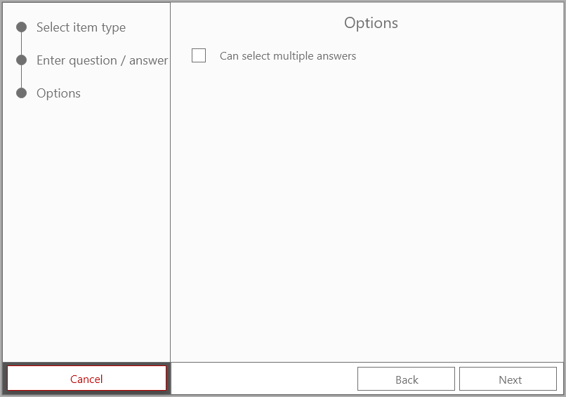

# Use Case Specification: Create multiple choice item
{: .no_toc }

## Table of contents
{: .no_toc .text-delta }

1. TOC
{:toc}

## 1. Create multiple choice item
### 1.1 Brief Description
In this use case the user can create a new multiple choice poll item. A multiple choice item consists of a question and two or more possible answers.
### 1.2 Mockup
#### Select item

#### Enter question / answers

#### Options


## 2. Flow of Events
### 2.1 Basic Flow


### 2.2 Feature Files
```gherkin
Feature: Create Multiple Choice Item

  Scenario: Create new multiple choice item successfully
    Given User is logged in
    And User has created a new poll
    And User opened new poll item menu
    When I select multiple choice item type
    And I enter "Idee" into input field with id "input-question"
    And I enter "Antwort 1" as answer option 1
    And I enter "Antwort 2" as answer option 2
    And I enter "Antwort 3" as answer option 3
    And I click on button with id "btn-save"
    Then Notification with text "Poll item successfully created" is displayed

  Scenario: Create new poll item but don't choose item type
    Given User is logged in
    And User has created a new poll
    And User opened new poll item menu
    When I select no item type
    And I click on button with id "btn-next-step"
    Then Notification with text "Please select item type" is displayed

  Scenario: Create new multiple choice item with only one answer
    Given User is logged in
    And User has created a new poll
    And User opened new poll item menu
    When I select multiple choice item type
    And I enter "Idee" into input field with id "input-question"
    And I enter "Antwort 1" as answer option 1
    And I click on button with id "btn-save"
    Then Notification with text "Please enter more than one answer" is displayed
```
### 2.3 Alternative Flows
n/a
## 3. Special Requirements
n/a
## 4. Preconditions
Following preconditions are needed:
- The user signed up.
- The user created a poll.
## 5. Postconditions
Once the user created a new multiple choice item, it must be saved on the server.
## 6. Extension Points
tbd

© Live-Poll 2020-2021