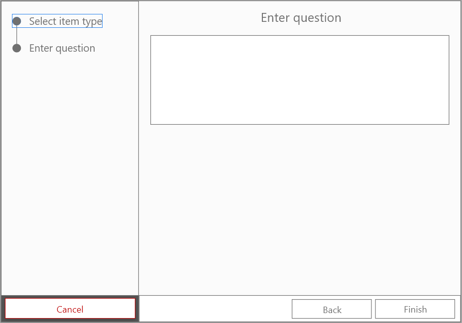

# Use Case Specification: Create open text question
{: .no_toc }

## Table of contents
{: .no_toc .text-delta }

1. TOC
{:toc}

## 1. Create open text question
### 1.1 Brief Description
In this use case the user can create a new open text question. In the case of an open text question, a question is displayed and each participant has an empty input field in which he can type his answer.
### 1.2 Mockup
#### Select item

#### Enter question

## 2. Flow of Events
### 2.1 Basic Flow

### 2.2 Feature Files
n/a
### 2.3 Alternative Flows
n/a
## 3. Special Requirements
n/a
## 4. Preconditions
Following preconditions are needed:
- The user signed up.
- The user created a poll.
## 5. Postconditions
Once the user created a new open text question, it must be saved on the server.
## 6. Extension Points
n/a