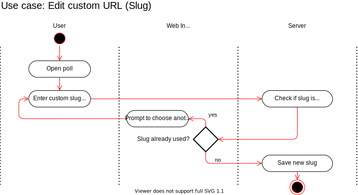

# Use Case Specification: Edit custom url slug
{: .no_toc }

## Table of contents
{: .no_toc .text-delta }

1. TOC
{:toc}

## 1. Edit url snippet
### 1.1 Brief Description
In this use case the user can customize the url with which one arrives at the poll.
### 1.2 Mockup
#### Select item

## 2. Flow of Events
### 2.1 Basic Flow

### 2.2 Feature Files
n/a
### 2.3 Alternative Flows
n/a
## 3. Special Requirements
n/a
## 4. Preconditions
Following preconditions are needed:
- The user signed up.
- The user created a poll.
## 5. Postconditions
Once the url has been edited, the new url must be saved on the server.
## 6. Extension Points
n/a