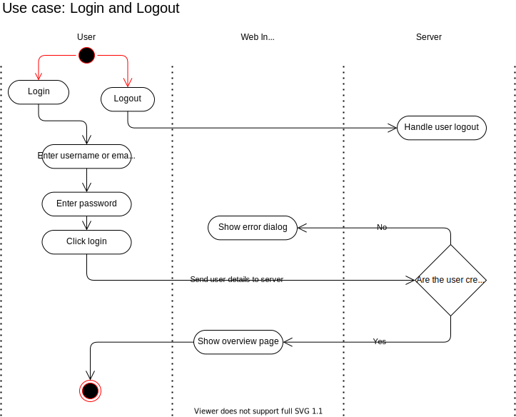

# Use Case Specification: Login and Logout
{: .no_toc }

## Table of contents
{: .no_toc .text-delta }

1. TOC
{:toc}

## 1. Login and Logout
### 1.1 Brief Description
In this use case the user logs in.
### 1.2 Mockup

## 2. Flow of Events
### 2.1 Basic Flow

### 2.2 Feature Files

### 2.3 Alternative Flows
n/a
## 3. Special Requirements
n/a
## 4. Preconditions
Following preconditions are needed:
- The user signed up.
## 5. Postconditions
The user must get a JWT token.
## 6. Extension Points
n/a