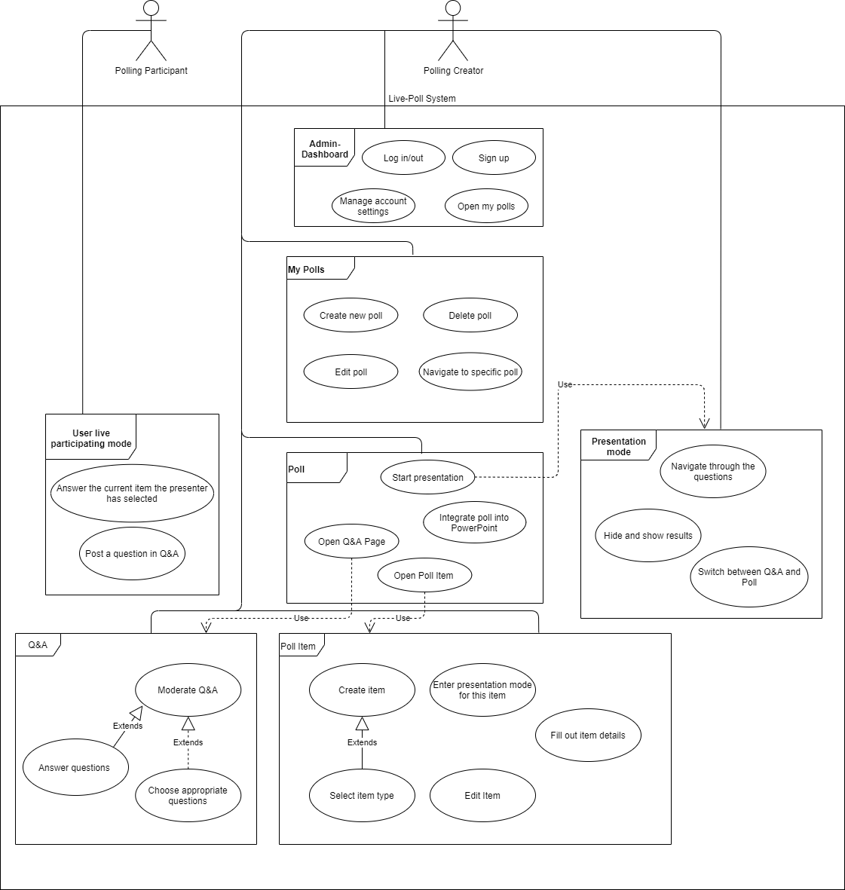

# Live-Poll Software Requirements Specification

## 1. Introduction
### 1.1 Purpose
This SRS describes all  specifications and use cases for Live-Poll. Live-Poll is an live-polling application which elevates your presentation and lets you stand out from the crowd. This documents includes a detailed description of the expected application functionalities as well as non-functionality requirements.

### 1.2 Scope
This SRS applies to the entire Live-Poll project. 

Actors: 
- Polling Creator: Person who creates and presents a poll.
- Polling Participant: Person who participates a poll.

Subsystems:
- Admin Dashboard
- My Polls
- Poll
- Presentation Mode
- Poll Item
- Q&A
- User live participating mode
- 
### 1.3 Definitions, Acronyms and Abbreviations
| Abbrevation |                                        |
| ----------- | -------------------------------------- |
| SRS         | Software Requirements Specification    |
| UCD         | Use Case Diagramm                      |
|FAQ          |Frequently Asked Questions

| Definition                          |     |
| ----------------------------------- | --- |
| Software Requirements Specification | Software Requirement Specification is a document, which captures the complete software requirements for the system, or a portion of the system. |
| Use Case                            | A Use case is a list of actions or event steps, typically defining the interactions between a role (known in the Unified Modeling Language as an actor) and a system, to achieve a goal. |

### 1.4 References
|Title                                             |Date      |Publishing Organization|
|--------------------------------------------------|----------|-----------------------|
|[Live-Poll Blog](https://blog.live-poll.de/week1/)|13.10.2020|Live-Poll              |

### 1.5 Overview
The following chapters are structured in the following way: In the next chapter, the Overall Description, our vision is described and the Use Case Diagramm gives an overview over the expected functionality. The third chapter provides more detailed information about the requirements. First, the expected functions of the Live-Poll application are presented. After that, further requirements like usability, reliability or performance are listed. In the last chapter you can find supporting information.
## 2. Overall Description
### 2.1 Vision
Live-Poll is the vision of an open-source live-polling application that you can use totally free, no matter if you’re a private person, school, university, society, small or big business etc. Our idea arose from the lack of free live voting/polling software on the Internet that has a nice user flow and is easy to use.

Live Poll will elevate your presentation and let you stand out from the crowd. It is an online tool allowing your audience to live-interact with the presenters, e.g. to answer questions, quizzes, multiple choice questions, word clouds and so much more.

### 2.2 Use Case Diagram

## 3. Specific Requirements
### 3.1 Functionality
This section lists and explains every functional requirement. Every subsystem from the UCD is represented through a own subsection.
#### 3.11 Admin Dashboard
The admin dashboard is the start point of our application.  After login in or creating a new account the user lands on the admin dashboard. Account settings can be managed here and the user can switch to the page with his polls.
#### 3.12 My Polls
On this page all polls are listed. The user can naviagte to specific polls and can edit o delete them. Also new polls canbe created here.
#### 3.13 Poll
On the Poll page a single poll can be edited and the user can start the presentation mode. For creating and editing the poll different poll items can be added. Furthermore every poll owns a Q&A page which can be accessed from here too.
#### 3.14 Poll Item
Every poll item has item type. The user can choose between following item types:
- Quiz
- Multiple Choice
- Rating
- Open text
- Word clouds

Depending on the type selected, different details can be entered. To see how the poll item looks in the presentation, the presentation mode for an item can be entered directly from it.
#### 3.15 Presentation Mode
In the presentation mode the questions can be presented to an audience. The presenter can switch betwwn the prepared poll items and can show or hide results. Q&A questions can be also shown in this mode. The shown questions are chooen by a moderator. The functionality for the moderation is explained in the next subsection.
#### 3.16 Q&A
The Q&A can be moderated on the Q&A page. Here the moderator can select questions which should appear in the presentation and questions can be awnsered via text message.
#### 3.17 User live participating mode
This page can be accessed from paricipants via QR code or an ID. The page shows the current question from the presentation and the user can enter his awnser here.
### 3.2 Usability
Our goal is to build a modern and easy to use application.
### 3.3 Reliability
We will try to reduce the server downtime to a minimum. Updates or other changes will be apllied during night time.
### 3.4 Performance
Especially the page for the live participants should load fast. Many simultaneous inquiries must not reduce the speed.
### 3.5 Supportability
To be able to test and publish updates quickly, we use docker containers.
### 3.6 Design Constraints
The angular frontend should implement the MVC pattern.

There should be a RESTful API for communication between client and server. That's why we use the spring framework for the backend.
### 3.7 Online User Documentation and Help System Requirements
To make the application easy to understand we will create a FAQ. 
### 3.8 Purchased Components
A server will be rent to run the application.
### 3.9 Interfaces
n/a
#### 3.9.1 User Interfaces
n/a
#### 3.9.2 Hardware Interfaces
n/a
#### 3.9.3 Software Interfaces
Our application will support all common browsers(Chrome, Opera, Firefox, Safari). The Internet explorer will not be supported.
#### 3.9.4 Communication Interfaces
Client and server will use the `HTTPS` protokoll for communication.
### 3.10 Licensing Requirements
n/a
### 3.11 Legal Copyright and Other Notices
The Live-Poll team will not take responsibility for incorrect or lost data. 
### 3.12 Applicable Standards
The following code standards are going to be applied to the code as far as possible:

1. Intuitive names of variables and methods (camel case) 
2. Use of comments to make code easy to understand
3. Each method does one thing

## 4. Supporting Information
For more information visit our [blog](https://blog.live-poll.de) or contact us: contact@live-poll.de

© Live-Poll 2020