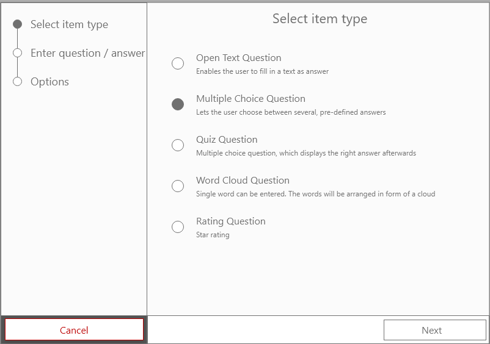
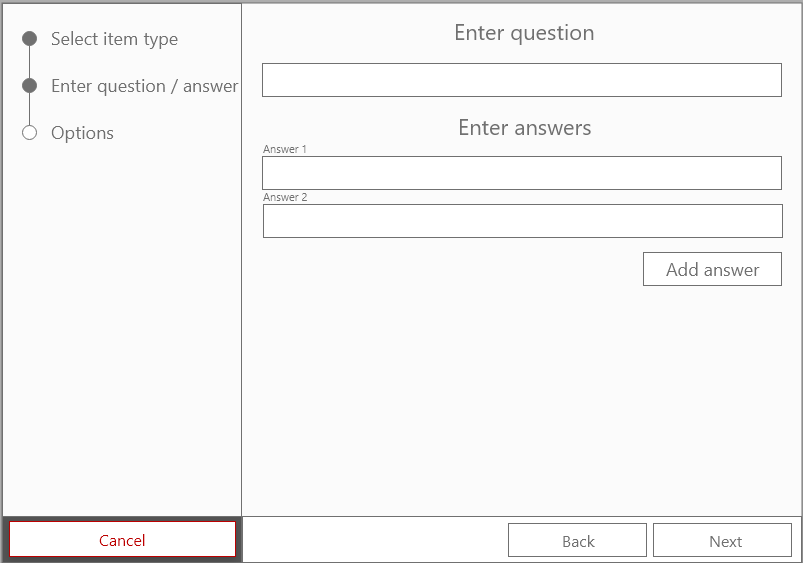
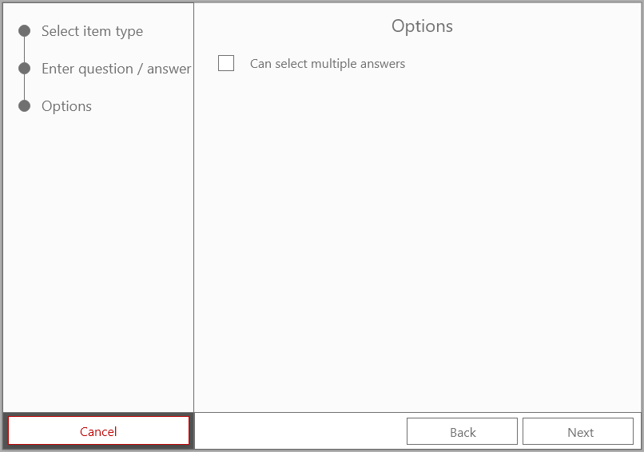

# Use Case Specification: Create multiple choice item

## Table of contents
1. [Create multiple choice item](#1-create-multiple-choice-item)
    + [1.1 Brief Description](#11-brief-descsription)
    + [1.2 Mockup](#12-mockup)
2. [Flow of Events](#2-flow-events)
    + [2.1 Basic Flow](#21-basic-flow)
    + [2.2 Alternative Flows](#22-alternative-flows)
3. [Special Requirements](#3-special-requirements)
4. [Preconditions](#4-preconditions)
5. [Postconditions](#5-postconditions)
6. [Extension Points](#6-extension-points)

## 1. Create multiple choice item
### 1.1 Brief Description
In this use case the user can create a new multiple choice poll item. A multiple choice item consists of a question and two or more possible answers.
### 1.2 Mockup
#### Select item

#### Enter question / answers

#### Options

## 2. Flow of Events
### 2.1 Basic Flow

### 2.2 Alternative Flows
n/a
## 3. Special Requirements
n/a
## 4. Preconditions
Following preconditions are needed:
- The user signed up.
- The user created a poll.
## 5. Postconditions
Once the user created a new multiple choice item, it must be saved on the server.
## 6. Extension Points
tbd