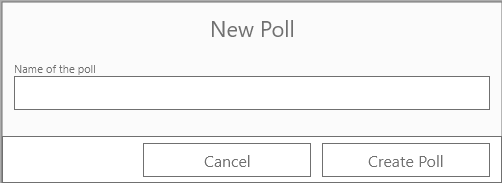
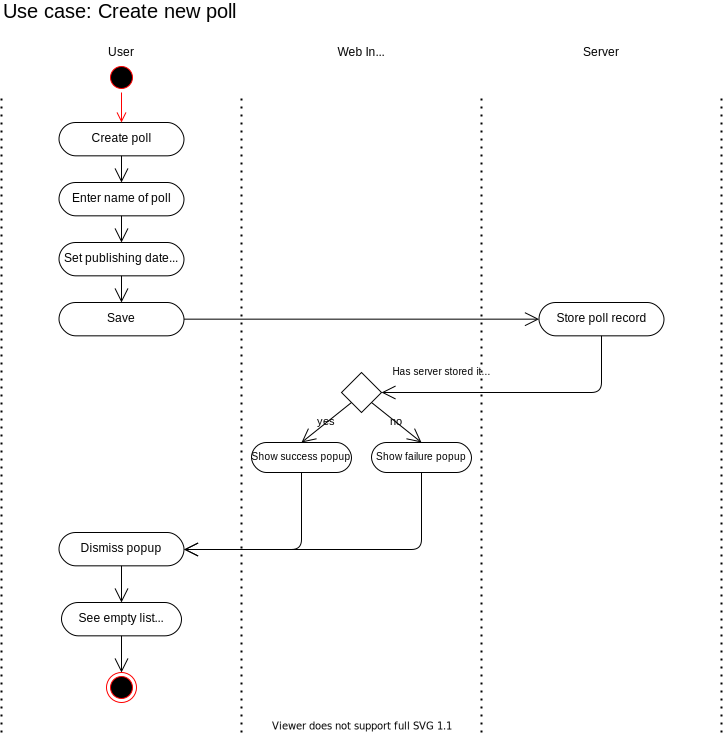

# Use Case Specification: Create new poll

## Table of contents
1. [Create new poll](#1-create-new-poll)
    + [1.1 Brief Description](#11-brief-descsription)
     + [1.2 Mockup](#12-mockup)
2. [Flow of Events](#2-flow-events)
    + [2.1 Basic Flow](#21-basic-flow)
    + [2.2 Feature Files](#22-feature-files)
    + [2.3 Alternative Flows](#23-alternative-flows)
3. [Special Requirements](#3-special-requirements)
4. [Preconditions](#4-preconditions)
5. [Postconditions](#5-postconditions)
6. [Extension Points](#6-extension-points)


## 1. Create new poll
### 1.1 Brief Description
In this use case the user creates a new poll. A name for the poll and a publishing date must be entered.
### 1.2 Mockup


## 2. Flow of Events
### 2.1 Basic Flow


### 2.2 Feature Files
```gherkin
Feature: Create New Poll

  Scenario: Create new poll successfully
    Given User is logged in
    And  User has opened new poll item menu
    When I enter "my new poll" into input field with id "input-name"
    And I click button with id "btn-create"
    Then Notification with text "Poll successfully created" is displayed

  Scenario: Create new poll with empty name
    Given User is logged in
    And  User has opened new poll item menu
    When I enter "" into input field with id "input-name"
    And I click button with id "btn-create"
    Then Notification with text "Please enter a name" is displayed

```

### 2.3 Alternative Flows
n/a
## 3. Special Requirements
n/a
## 4. Preconditions
Following preconditions are needed:
- The user signed up.
## 5. Postconditions
The created poll must be saved on the server.
## 6. Extension Points
tbd
